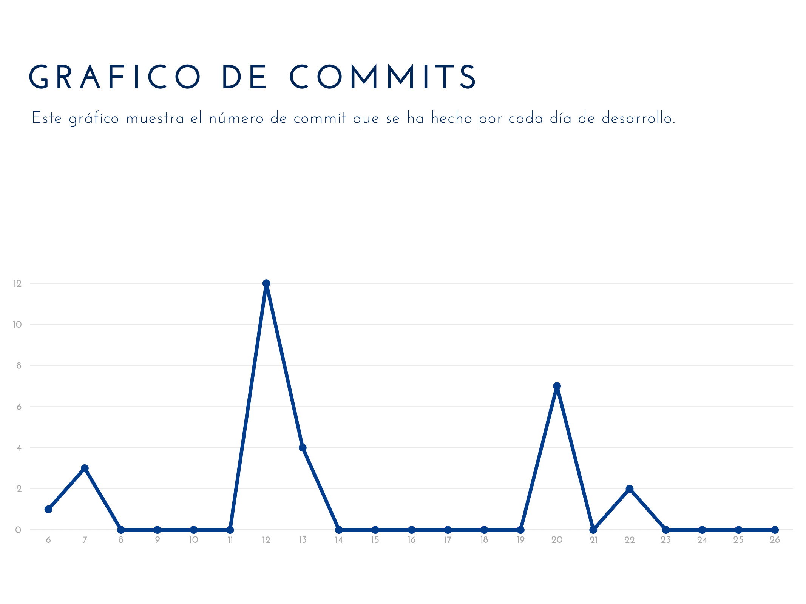

# Informe Técnico: Historia del Proyecto

## Resumen Ejecutivo
El proyecto consiste en hacer la página web de una clínica de mascotas.

## Introducción
Para ayudar a la gestión de una clinica de mascotas nuestro equipo esta creando la página PetClinic.

## Metodología
Para llevar a cabo la tarea antes descrita, vamos a utilizar el framework de SpringBoot, para la base de datos vamos a utilizar Hibernate, para el desarrollo de la página web, para el Front-end usamos los legunajes css, JavaScript y HTML, para el Back-end usamos el legunaje Java.

## Desarrollo de la Historia del Proyecto
- El repositorio se crea el 5 de febrero de 2024.
- El 6 de febrero de 2024, los miembros del equipo de desarrollo empiezan a clonar el proyecto en sus máquinas locales.
- El 7 de febrero de 2024, se crean las tarear que tiene que desarrollar el equipo de trabajo.

### Fase 1: Primera semana de desarrollo
Para la primera semana de desarrollo, la cual es desde el 6 de febreo hasta el 12 de febrero, se llevaron hasta la columna de done las siguentes tareas:

- Cambio en el pom.xml, esta tarea se dividio en 5 tareas, las cuales consistían en que cada miembro del equipo se añadiran uno a uno en el pom.xml.
- Cambio de color, esta tarea consistía en cambiar el color a los botones que aparecen en la pantalla MyPets.
- Cambio de mensaje de inicio, esta tarea consistía en cambiar el mensaje de la pantalla de inicio.

En esta semana ningún miembro tuvo problemas de conflictos.

### Fase 2: Segunda semana de desarrollo
Para la segunda semana de desarrollo, la cual es desde el 13 de febreo hasta el 19 de febrero, se llevaron hasta la columna de done las siguentes tareas:

- Cambiar el color de fondo de la cabecera de la tabla Consultations, esta tarea consistía en cambiar el color antiguo por uno verde.
- Cambiar información grupal en el pom.xml, esta tarea consistía en cambiar unos parametros del pom.xml.
- Cambio del archivo info.yml, esta tarea consistía en reflejar la información real del grupo.
- Cambio de imagen, esta tarea consistía en cambiar la imagen de la página de inicio.

En esta semana ningún miembro tuvo problemas de conflictos.

### Fase 2: Tercera semana de desarrollo
Para la tercera semana de desarrollo, la cual es desde el 20 de febreo hasta el 26 de febrero, se llevaron hasta la columna de done las siguentes tareas:

- Cambiar color de los gradientes, esta tarea consistía en cambiar el color de los gradientes de las tarjetas de la página Plans.
- Daily Stand-ups Meeting 13/02, esta tarea consistía en crear el acta del daily stand-ups del 13 de febrero.
- Cambio de iconos en /plans, esta tarea consistía en cambiar los iconos de las tarjetas de la página Plans.
- Daily Stand-ups Meeting 20/02/2024, esta tarea consistía en crear el acta del daily stand-ups del 20 de febrero.

## Resultados
A día 22 de febrero se han llevado a done 15 tareas de las 25 que hay que hacer para la primera entrega del proyecto.

## Conclusiones
Para la completar las tareas todos los miembro del equipo han tenido que trabajar en conjunto y ponerle una gran de dicación a que el proyecto salga adelante.

## Referencias

