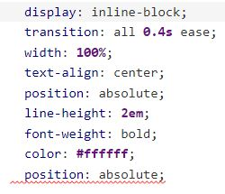

# Análisis del código fuente y métricas asociadas

## Panel de SonarQube

SonarQube analiza el código fuente mediante 7 ejes/dimensiones de calidad:
- Bugs: se tratan de errores potenciales en el código.
- Vulnerabilities: indica si el código presenta vulnerabilidades.
- Hotspots Reviewed: indican el porcentaje de fragmentos de código, que señalan un posible riesgo de seguridad, que se han revisado.
- Code Smells: son características en el código fuente que posiblemente indiquen un problema más prdofundo.
- Coverage: ayuda a identificar que partes del programa han sido ejecutadas por un conjunto de casos de prueba, asegurando que las partes más críticas sean probadas.
- Duplications: indica el porcentaje de código duplicado.
- Lines: número de líneas que componen el código fuente.

### Panel de SonarQube del primer lanzamiento

Podemos distinguir entre el backend y el frontend:
#### Backend -> PSG2-2324-G3-33 Petclinic 
- Bugs: 3 errores potenciales en el código.
- Vulnerabilities: 0 vulnerabilidades.
- Hotspots Reviewed: se han revisado 0 fragmentos de código que señalen un posible riesgo de seguridad.
- Code Smells: se han detectado 227 code smells.
- Coverage: con los test se ha cubierto un 77.7% del código.
- Duplications: el porcentaje de código duplicado es del 0.0%.
- Lines: aproximadamente 4100 líneas en lenguaje Java y XML.

#### Frontend -> PSG2-2324-G3-33-frontend
- Bugs: 4 errores potenciales en el código.
- Vulnerabilities: 0 vulnerabilidades.
- Hotspots Reviewed: se han revisado 0 fragmentos de código que señalen un posible riesgo de seguridad.
- Code Smells: se han detectado 149 code smells.
- Coverage: con los test se ha cubierto un 0.0% del código, ya que no se han realizado pruebas de frontend.
- Duplications: el porcentaje de código duplicado es del 16.9%.
- Lines: aproximadamente 11000 líneas en lenguaje JavaScript, CSS y HTML.

### Panel de SonarQube del segundo lanzamiento

Podemos distinguir entre el backend y el frontend:
#### Backend -> PSG2-2324-G3-33 Petclinic 
- Bugs: 3 errores potenciales en el código.
- Vulnerabilities: 0 vulnerabilidades.
- Hotspots Reviewed: se han revisado 0 fragmentos de código que señalen un posible riesgo de seguridad.
- Code Smells: se han detectado 253 code smells.
- Coverage: con los test se ha cubierto un 76.0% del código.
- Duplications: el porcentaje de código duplicado es del 0.0%.
- Lines: aproximadamente 4500 líneas en lenguaje Java y XML.

#### Frontend -> PSG2-2324-G3-33-frontend
- Bugs: 4 errores potenciales en el código.
- Vulnerabilities: 0 vulnerabilidades.
- Hotspots Reviewed: se han revisado 0 fragmentos de código que señalen un posible riesgo de seguridad.
- Code Smells: se han detectado 189 code smells.
- Coverage: con los test se ha cubierto un 0.0% del código, ya que no se han realizado pruebas de frontend.
- Duplications: el porcentaje de código duplicado es del 16.4%.
- Lines: aproximadamente 11000 líneas en lenguaje JavaScript, CSS y HTML.

---

### Bugs del Frontend

**Nombre:** 
Remove this conditional structure or edit its code           blocks so that they're not all the same.

**Descripción:** 
Todas las ramas en una estructura condicional no deberían tener exactamente la misma implementación.

**Causas:** 
Las condiciones if y else devuelven lo mismo.

**Evaluación:**
Aunque técnicamente no es un error que causará una falla inmediata en el programa, puede ser considerado un problema de calidad de código y puede tener implicaciones en la legibilidad, mantenibilidad y escalabilidad del código.

**Soluciones:** 
-Sería lanzar un nuevo error después del else.
-La mejor opción sería esta: Simplificar el código quitando la estructura if-else y simplemente devolver response.json() directamente después de la llamada a fetch().
                      
---          

 

**Nombre:** 
Unexpected missing generic font family

**Descripción:** 
Si ninguno de los nombres de fuentes definidos en una fuente o declaración de familia de fuentes está disponible en el navegador del usuario, el navegador mostrará el texto usando su fuente predeterminada.

**Causas:** 
No tener ninguno de los nombres de fuentes definidos.

**Evaluación:**
Este problema no es grave, pero es una buena práctica en diseño web seguir las recomendaciones para garantizar una mejor consistencia y accesibilidad.

**Soluciones:** 
Se recomienda definir siempre una familia de fuentes genérica para cada declaración de fuente o familia de fuentes para obtener una situación menos degradada que confiar en la fuente predeterminada del navegador.

---

**Nombre:**
Unexpected duplicate "position"

**Descripción:**
La palabra position está duplicada.

**Causas:** 
El atributo position está duplicado.

**Evaluación:**
Esto puede no ser un error grave, pero puede causar comportamientos inesperados en la apariencia o el diseño de los elementos afectados.
Cuando se duplica una propiedad CSS en una regla, la segunda instancia generalmente anula la primera. Por lo tanto, si la primera instancia de position: absolute; tiene efecto en un elemento y la segunda instancia cambia su valor, esto puede alterar el diseño esperado del elemento.

**Soluciones:**
Para corregir este problema, simplemente elimina una de las instancias duplicadas para mantener el estilo coherente y evitar posibles confusiones en la interpretación del código CSS.

--- 

**Nombre:**
Unexpected duplicate "height"

**Descripción:**
La palabra height está duplicada.

**Causas:** 
El atributo height está duplicado.

**Evaluación:**
Esto puede no ser un error grave, pero puede causar comportamientos inesperados en la apariencia o el diseño de los elementos afectados.
Cuando se duplica una propiedad CSS en una regla, la segunda instancia generalmente anula la primera. Por lo tanto, si la primera instancia de position: absolute; tiene efecto en un elemento y la segunda instancia cambia su valor, esto puede alterar el diseño esperado del elemento.

**Soluciones:**
Para corregir este problema, simplemente elimina una de las instancias duplicadas para mantener el estilo coherente y evitar posibles confusiones en la interpretación del código CSS.

---

### Bugs del Backend

**Nombre:**
Call "Optional#isPresent()" before accessing the value.
(Agrupo dos bugs aquí, el de ClinicService y el de ClinicOwnerService)

**Descripción:**
El mensaje de error sugiere llamar Optional#isPresent() antes de acceder al valor dentro de un Optional. Este error puede causar una excepción NoSuchElementException si el Optional está vacío.

**Causas:** 
La causa del problema es que se está accediendo directamente al valor de un Optional sin verificar si el Optional devuelto por findById contiene un valor.

**Evaluación:**
El impacto de este bug es que el código puede lanzar una excepción NoSuchElementException si el Optional está vacío. Esto puede causar una interrupción en la ejecución del programa y potencialmente dejar el estado del sistema en un estado inconsistente.

**Soluciones:**
La solución es verificar si el Optional está presente antes de acceder a su valor. Esto se puede hacer llamando a Optional#isPresent() o utilizando métodos como Optional#orElse() o Optional#orElseThrow() para proporcionar un valor predeterminado o lanzar una excepción si el Optional está vacío.

---

**Nombre:**
Refactor the code so this stream pipeline is used.

**Descripción:**
El mensaje de error sugiere refactorizar el código para usar un pipeline de stream en lugar de iterar sobre la lista manualmente. Esto puede mejorar la legibilidad y el rendimiento del código.

**Causas:** 
El problema radica en que el código actual itera manualmente sobre la lista de habitaciones del hotel de mascotas para filtrar las habitaciones pertenecientes a un propietario de clínica específico. Esto puede ser menos eficiente y menos legible que usar un pipeline de stream de Java 8.

**Evaluación:**
El impacto de este bug es principalmente en la legibilidad y el mantenimiento del código. Iterar manualmente sobre la lista puede ser propenso a errores y menos eficiente que usar funcionalidades proporcionadas por Java 8, como los pipelines de stream.

**Soluciones:**
La solución es refactorizar el método getPetHotelRoomsByClinicOwnerUserId para utilizar un pipeline de stream en lugar de iterar manualmente sobre la lista. Esto puede mejorar la legibilidad del código y potencialmente mejorar su rendimiento.